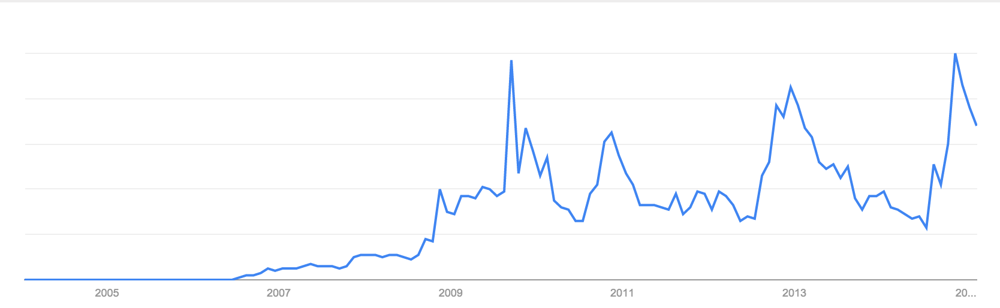

If you search Google trends for a term like "taylor+swift", and set your timescale to "2004 to present", you'll get an interesting graph that does demonstrate the meteoric rise to stardom of the pop star. 

Google also gives you an option to download the data as a .CSV file; this is a great option if you want to compare trends in a more rigorous way than looking at their graphs side by side.

However there's an issue with the timescales: if you download data from 2004 to present, Google will give you monthly or weekly data, but if you download data from June 2009, Google will give you daily data (unless it's negligable). 

I wrote a small script that searches Google trends for a certain term over a specified time frame, but does so over multiple small time intervals to obtain small time-scale data, and then stitches it all together using the full time scale for consistency. 